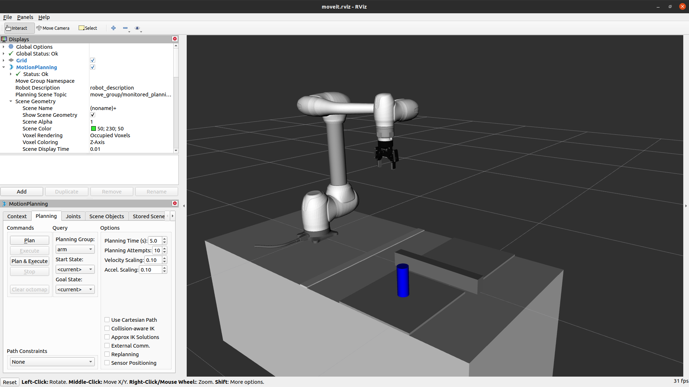
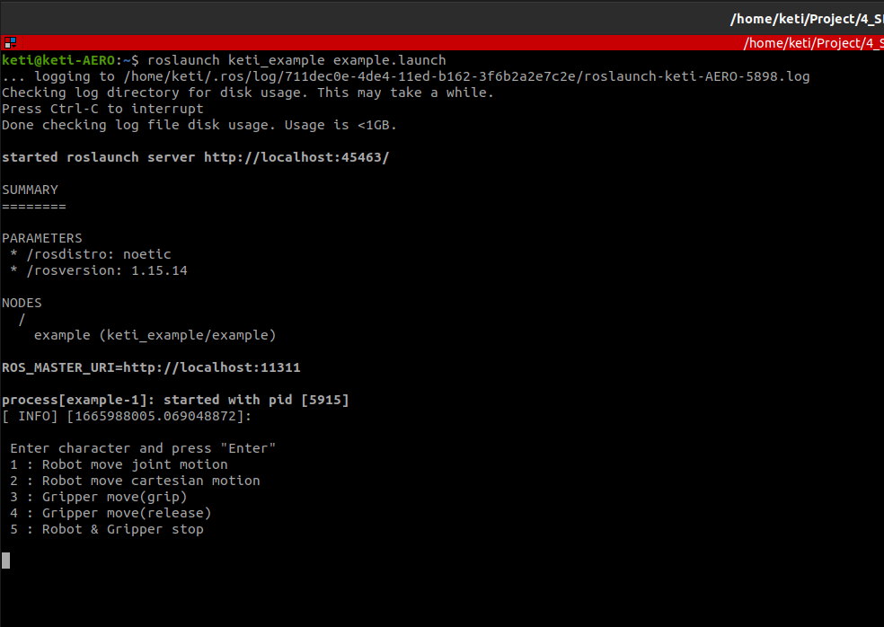

***

### Environment

#### Linux Version : Ubuntu 20.04
#### ROS version : noetic

***

### 1. Install ROS MoveIt
~~~
sudo apt install ros-noetic-moveit*
~~~

### 2. Download & Install [Doosan robot](http://wiki.ros.org/doosan-robotics) ROS package  
 

### 3. Download & Install Project
~~~
cd ~/catkin_ws/src
git clone https://github.com/robot-plus-program/sdkchallenge.git
cm
~~~
\* package의 종속성 문제로 에러 발생할 수 있음. 재빌드 실행 시 이상없이 빌드 됨.

### 4. Run robot simulator
~~~
roslaunch keti_robot robot_control_sim.launch
~~~

### 5. Run simulator operating example
~~~
roslaunch keti_example example.launch
~~~
