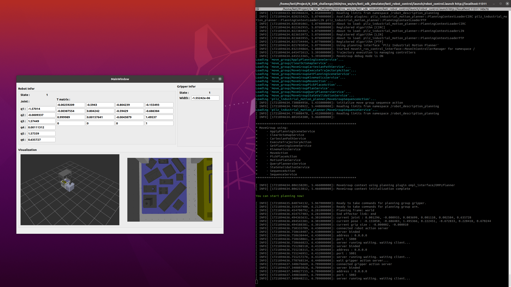

***
## Environment

### Linux Version : Ubuntu 20.04
***

 

## 1. 운영체제 업데이트
~~~
sudo apt-get update && sudo apt-get upgrade
~~~

## 2. library 설치
~~~
sudo apt-get install cmake build-essential git 
sudo apt-get install libmodbus*

sudo apt install python3-pip
pip3 install pymodbus
~~~

## 2. KETI SDK 다운로드
~~~
git clone https://github.com/robot-plus-program/sdk_challenge.git
~~~

## 3. Build & Run example
### 3.1 C++
~~~
cd ${download sdk_challenge folder}
mkdir build
cd build
cmake ..
make
./example xxx.xxx.xxx.xxx ooo.ooo.ooo.ooo port_num
~~~
### 3.2 Python
~~~
cd ${download sdk_challenge folder}/scripts
chmod +x example.py
python3 example.py xxx.xxx.xxx.xxx ooo.ooo.ooo.ooo port_num
~~~
xxx.xxx.xxx.xxx : Robot IP address 
ooo.ooo.ooo.ooo : Gripper IP address 
port_num : Gripper port number 
### 3.3 Python_Orientation
~~~
pip install math3d==3.0.0
cd ${download sdk_challenge folder}/scripts
chmod +x example_orientation.py
python3 example_orientation.py
~~~

***
## 4. Simulator
### 4.1 ROS noetic 설치 
http://wiki.ros.org/noetic/Installation/Ubuntu 
http://wiki.ros.org/ROS/Tutorials/InstallingandConfiguringROSEnvironment 

### 4.2 ROS moveit 설치
~~~
sudo apt-get install ros-noetic-moveit*
~~~

### 4.3 ROS controller 설치
~~~
sudo apt-get install ros-noetic-controller-*
sudo apt-get install ros-noetic-joint-trajectory-controller
~~~

### 4.4 ROS 환경 설정
터미널 접속 후 **gedit ~/.bashrc** 명령어 실행, 아래 내용 추가  
~~~
source ~/catkin_ws/devel/setup.bash
alias cw='cd ~/catkin_ws'
alias cs='cd ~/catkin_ws/src'
alias cm='cd ~/catkin_ws && catkin_make'
~~~
.bashrc 파일 편집 후 터미널에서 **source ~/.bashrc** 명령어 실행  

### 4.5 ROS workspace로 source code 복사 및 빌드
~~~
cd ${download sdk_challenge folder}
cp -r keti_sdk_simulator/ ~/catkin_ws/src/
cd ~/catkin_ws/
catkin_make
~~~

### 4.6 Simulator 실행
~~~
roslaunch keti_robot_control robot_control.launch
~~~

