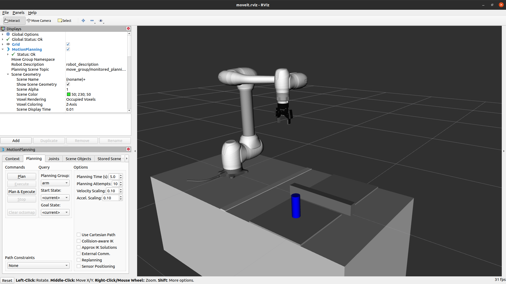

***

### Environment

#### Linux Version : Ubuntu 20.04
#### ROS version : noetic

***

 

### 1. Install ROS MoveIt
~~~
sudo apt install ros-noetic-moveit*
~~~

### 2. Download & Install [Doosan robot](http://wiki.ros.org/doosan-robotics) ROS package  
 

### 3. Download & Install Project
~~~
cd ~/catkin_ws/src
git clone https://github.com/robot-plus-program/sdk_challenge.git
cm
~~~
\* package의 종속성 문제로 에러 발생할 수 있음. 재빌드 실행 시 이상없이 빌드 됨.

 

# Simulation mode
### 1. Run robot simulator
~~~
roslaunch keti_robot robot_control_sim.launch
~~~

### 2. Run simulator operating example
~~~
roslaunch keti_example example.launch mode:=virtual
~~~

 

# Real mode
### 1. Ready
~~~
(1) Robot & Control box power on.

(2) Teaching Pendant(TP) power on. Long press power button.

(3) Robot motor servo on.

(4) Communication program run in TP.

(5) Gripper & Gripper compute box power on.
~~~
### 2. Run robot controller
~~~
roslaunch keti_robot robot_control.launch robot_ip:=192.168.137.10x
~~~
x = 1 or 2

### 3. Run example(c++)
~~~
roslaunch keti_example example.launch mode:=real
~~~

### 4. Run example(python)
~~~
rosrun keti_example example.py
~~~