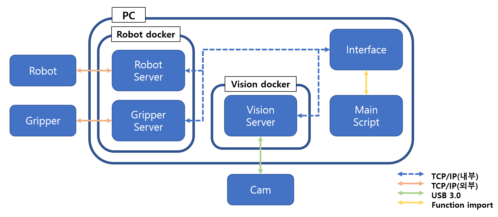

***
## Environment

### Linux Version : 22.04
### Python version : 3.8
### Docker Version : 28.3.3
***

## 시스템 구성도

***

## 환경 구성
### [VISION SDK 환경 구성](VISION/README.md)

### [로봇 통합 SDK 환경 구성](ROBOT/README.md)

*** 

## VISION & ROBOT 통합 구동
### 1. Vision
```
run_vision
########## container 내부 ##########
cd ~/volume/VISION
pyton3 run_server_talos.py
```

### 2. Robot
```
docker start -ai ketirobotctrl
########## container 내부 ##########
cd ~/project
python3 run_server.py
```

### 3. main script (Local PC)
```
source venv/bin/activate
pythoh3 main.py
```