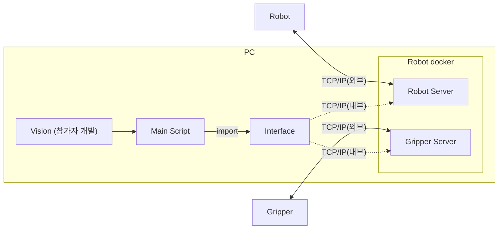

***
## Environment

### Linux Version : 22.04
### Python version : 3.8
### Docker Version : 28.3.3
***

## 시스템 구성도

```mermaid
flowchart LR
    Robot <-- "TCP/IP(외부)" --> RS
    Gripper <-- "TCP/IP(외부)" --> GS
    subgraph PC
        subgraph Robot docker
            RS[Robot Server]
            GS[Gripper Server]
        end
        Interface -. "TCP/IP(내부)" .-> RS
        Interface -. "TCP/IP(내부)" .-> GS
        Main[Main Script] -- import --> Interface
        Vision["Vision (참가자 개발)"] --> Main
    end
```
***

## 환경 구성
### [로봇 통합 SDK 환경 구성](ROBOT/README.md)

***

## ROBOT 통합 구동
### 1. Robot
```
docker start -ai ketirobotctrl
########## container 내부 ##########
cd ~/project
python3 run_server.py      # robot + gripper server
# python3 robot_server.py  # gripper 없이 robot server만 실행
```
server는 client 재접속을 받지 않으므로 `main.py`를 다시 실행할 때는 server도 재시작하세요.
로봇 연결에 실패하면 `[error] robot connect failed` 메시지를 출력하고 종료합니다. 로봇 전원과 네트워크를 확인하세요.

### 2. main script (Local PC)
```
# 최초 1회
python3 -m venv venv
source venv/bin/activate
pip install numpy

# 실행
source venv/bin/activate
python3 main.py
```

`main.py`의 `get_pick_offset()`, `get_angle_offset()`는 로봇 동작 확인용 고정값을 반환합니다. 참가자가 개발한 Vision 결과로 교체하여 사용하세요.

**RB10에서 `main.py` 실행 전 확인**
- joint/pose 값은 이전 로봇(M1013) 기준입니다. 실행 전에 반드시 다시 티칭하세요.
- RB10은 이 SDK에서 힘 제어/순응 제어를 지원하지 않습니다. `RobotComplianceCtrlOn()`, `RobotSetToolForce()` 등은 호출해도 동작하지 않으므로 `insert()`는 위치 제어로만 동작합니다.
- RB10의 `ControlBoxDigitalIn()`은 SDK 버그로 올바른 값을 반환하지 않습니다. `press()`의 DI 대기가 바로 통과하거나 끝나지 않을 수 있으므로 수정 전에는 사용하지 마세요.
