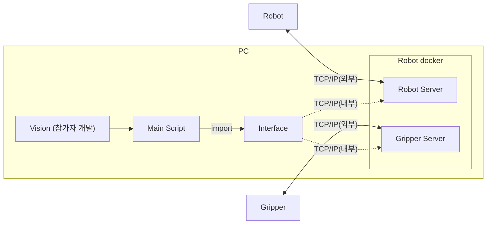

***
## Environment

### Linux Version : 22.04
### Python version : 3.8
### Docker Version : 28.3.3
***

## 2026 변경 사항
- 2026년부터 **Vision은 제공하지 않습니다.** 물체 인식은 참가자가 직접 개발합니다.
- 로봇 & 그리퍼 제어용 기본 코드(SDK, 서버 docker, 예제)만 제공합니다.
- 2025년도 자료(Vision 포함)는 [`2025` branch](https://github.com/robot-plus-program/sdk_challenge/tree/2025)에 있습니다.
- 로봇이 **Doosan M1013 → Rainbow RB10**으로 변경되었습니다. `ketiroxteam/talos-robot:latest` 이미지의 robot server가 RB10에 맞게 수정되었으므로, 이전에 받은 이미지/컨테이너는 다시 받아서 새로 생성하세요.
  ```
  docker pull ketiroxteam/talos-robot:latest
  docker rm -f ketirobotctrl   # 기존 container 삭제
  docker run -it -d --network=host --name ketirobotctrl ketiroxteam/talos-robot:latest /bin/bash
  ```
- `main.py`의 joint/pose 값은 이전 로봇(M1013) 기준입니다. RB10에서 실행하기 전에 반드시 다시 티칭하세요.
- RB10은 이 SDK에서 **힘 제어/순응 제어를 지원하지 않습니다.** `RobotComplianceCtrlOn()`, `RobotSetToolForce()`, `RobotReleaseForce()`, `RobotComplianceCtrlOff()`는 호출해도 아무 동작을 하지 않고, `tool_force`는 항상 0입니다. `main.py`의 `insert()`는 위치 제어로만 동작하므로 RB10에 맞게 삽입 동작을 다시 구성하세요.

| 장비 | IP | Port |
|------|----|------|
| Robot (RB10) | 192.168.137.50 | 5000 |
| Gripper (Zimmer) | 192.168.137.254 | 502 |

***

## 시스템 구성도

```mermaid
flowchart LR
    Robot <-- "TCP/IP(외부)" --> RS
    Gripper <-- "TCP/IP(외부)" --> GS
    subgraph PC
        subgraph Robot docker
            RS[Robot Server]
            GS[Gripper Server]
        end
        Interface -. "TCP/IP(내부)" .-> RS
        Interface -. "TCP/IP(내부)" .-> GS
        Main[Main Script] -- import --> Interface
        Vision["Vision (참가자 개발)"] --> Main
    end
```
***

## 환경 구성
### [로봇 통합 SDK 환경 구성](ROBOT/README.md)

***

## ROBOT 통합 구동
### 1. Robot
```
docker start -ai ketirobotctrl
########## container 내부 ##########
cd ~/project
python3 run_server.py      # robot + gripper server
# python3 robot_server.py  # gripper 없이 robot server만 실행
```
server는 client 재접속을 받지 않으므로 `main.py`를 다시 실행할 때는 server도 재시작하세요.

### 2. main script (Local PC)
```
# 최초 1회
python3 -m venv venv
source venv/bin/activate
pip install numpy

# 실행
source venv/bin/activate
python3 main.py
```

`main.py`의 `get_pick_offset()`, `get_angle_offset()`는 로봇 동작 확인용 고정값을 반환합니다. 참가자가 개발한 Vision 결과로 교체하여 사용하세요.
