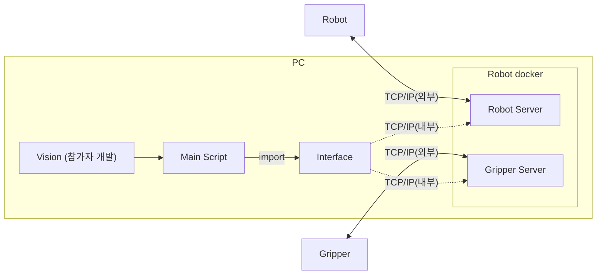

***
## Environment

### Linux Version : 22.04
### Python version : 3.8
### Docker Version : 28.3.3
***

## 2026 변경 사항
- 2026년부터 **Vision은 제공하지 않습니다.** 물체 인식은 참가자가 직접 개발합니다.
- 로봇 & 그리퍼 제어용 기본 코드(SDK, 서버 docker, 예제)만 제공합니다.
- 2025년도 자료(Vision 포함)는 [`2025` branch](https://github.com/robot-plus-program/sdk_challenge/tree/2025)에 있습니다.
***

## 시스템 구성도

```mermaid
flowchart LR
    Robot <-- "TCP/IP(외부)" --> RS
    Gripper <-- "TCP/IP(외부)" --> GS
    subgraph PC
        subgraph Robot docker
            RS[Robot Server]
            GS[Gripper Server]
        end
        Interface -. "TCP/IP(내부)" .-> RS
        Interface -. "TCP/IP(내부)" .-> GS
        Main[Main Script] -- import --> Interface
        Vision["Vision (참가자 개발)"] --> Main
    end
```
***

## 환경 구성
### [로봇 통합 SDK 환경 구성](ROBOT/README.md)

***

## ROBOT 통합 구동
### 1. Robot
```
docker start -ai ketirobotctrl
########## container 내부 ##########
cd ~/project
python3 run_server.py
```

### 2. main script (Local PC)
```
source venv/bin/activate
python3 main.py
```

`main.py`의 `get_pick_offset()`, `get_angle_offset()`는 로봇 동작 확인용 고정값을 반환합니다. 참가자가 개발한 Vision 결과로 교체하여 사용하세요.
