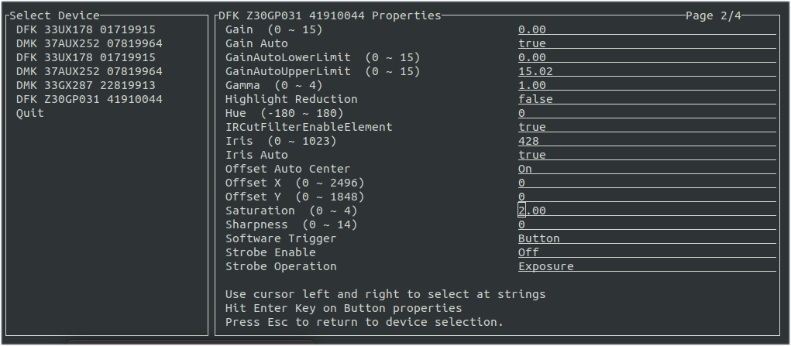

# tcam-dialog
This sample program lists and manipulates camera properties in the terminal.

It uses a simple device selection and shows the device's propertie for editing. It also allows to use a pipeline, so properties that are available only after a pipeline has been started, are shown. 

Programming language : C++

## Building
The sample uses the ncurses library. It is installed by
```
sudo apt-get install libncurses5-dev
```
The pthread library should be installed too:
```
sudo apt-get install libpthread-stubs0-dev
```

In case tiscamera was installed from deb package, following packages must be installed additionally:
```
sudo apt-get install libgstreamer1.0-0 gstreamer1.0-dev gstreamer1.0-tools gstreamer1.0-doc
sudo apt install libgstreamer1.0-dev libgstreamer-plugins-base1.0-dev
sudo apt-get install libgirepository1.0-dev
```

Building with
```
mkdir build
cd build
cmake ..
make
./tcam-dialog
```

## Command line parameters
### No Parameters
If tcam-dialog is started without command line parameters, then the tcambin Gstreamer module is used only. That means, no software properties like tone mapping are shown.

### -play
```
tcam-dialog -play
```
This uses the pipeline "tcambin name=source ! fakesink" and plays it. Thus the software properties are all visible.

### -d
```
tcam-dialog -d
```
This plays the pipeline 
```
tcambin name=source ! video/x-raw, format=BGRx ! videoconvert ! videoscale ! video/x-raw, width=320, height=240 ! ximagesink
```
It shows a small x-window with a live stream from the camera. All software properties are visible.

### -p
```
tcam-dialog -p "tcambin name=source ! video/x-raw, format=BGRx ! videoconvert ! ximagesink"
```
Pass a pipeline string, which is used for all cameras.
All software properties are visible.

## Changing property values
The cursor up and down keys are used for switching between input fields. The page up and down keys are used for changing pages.
If is not possible to switch between fiels or pages, then the value in the current input field is not valid. Try to enter a valid value.

Numeric values can be entered by typing the numbers and decimal point ".". The values become active by hitting the enter key

Boolean values are shown as "true" and "false". They can be changed by using the cursor left and right keys.

String, resp. enum values are shown as text, e.g. "On", "Off" etc. They can be changed by using the cursor left and right keys.

Button properties like software trigger are used by hitting the enter key.

All changes are effetive immediately. 

## Notice
The programs is a mix of C and C++. I am aware, there are many memory leaks in. They should be fixed in the future.

The NCurses field validation may fails. I tried to figure out, how that works as best as possible. 